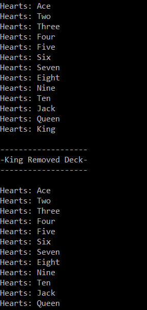

# Lab07_Collections

## Description
This project allows a user to create and interact with a deck of cards.  
The user can:  
1. Add a new card  
2. Delete a card at an index  
3. Shuffle the deck  

A Deck of cards can have the following numbers:  
 * Ace (1) (14)**  
 * Two (2)  
 * Three (3)  
 * Four (4)  
 * Five (5)  
 * Six (6)  
 * Seven (7)  
 * Eight (8)  
 * Nine (9)  
 * Ten (10)  
 * Jack (11)  
 * Queen (12)  
 * King (13)  
** Ace can be considered both the largest value (14) and the smallest value (1). In this project, it is considered 1.**

A Deck of cards can also have these suites:  
 * Hearts  
 * Diamonds  
 * Clubs  
 * Spades  

## Visual
Here is a picture of the Heart Suite before and after adding the King of Spades.  
  

Here is a picture of the Heart Suite before and after removing the King of Hearts.  
  

Here is a picture of the Heart Suite before and after a shuffle.  
  

## Directions to Use  
1. Install Visual Studio  
2. Clone this repository from GitHub.  
3. Open the sln file called "Lab07_Collections.sln" in Visual Studio.  
4. In the Debug menu, press the "Start Without Debugging" option.  

## Other Details
Currently there is not much user interface set up; it is there for testing and demonstration purposes only.  
The Deck class and Card class are the heart of this project.  